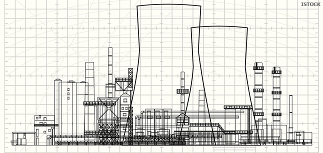

```{css, echo=FALSE}
/*note the side-bar after the first page can only be eliminated by placing this css chunk here.  It cannot work in css.*/
.pagedjs_page:not(:first-of-type) {
  --sidebar-width: 0rem;
  --sidebar-background-color: #ffffff;
  --main-width: calc(var(--content-width) - var(--sidebar-width));
  --decorator-horizontal-margin: 0.2in;
}

```


```{r, include=F, warning=F}
library(fontawesome)

```


```{r, include=F}
source("/Job Hunting/Job applications/applications after 2022.11.30/job duty repository/repository_lifelabs.R")
source("/Job Hunting/Job applications/applications after 2022.11.30/job duty repository/repository_consultant.R")
source("/Job Hunting/Job applications/applications after 2022.11.30/job duty repository/repository_aecl.R")
source("/Job Hunting/Job applications/applications after 2022.11.30/job duty repository/repository_northern_college.R")
source("/Job Hunting/Job applications/applications after 2022.11.30/job duty repository/repository_testmark.R")
source("/Job Hunting/Job applications/applications after 2022.11.30/job duty repository/repository_sgs.R")
source("/Job Hunting/Job applications/applications after 2022.11.30/job duty repository/repository_total.R")
source("/Job Hunting/Job applications/applications after 2022.11.30/job duty repository/repository_weblinks.R")

```


Aside
================================================================================




Contact Info {#contact}
--------------------------------------------------------------------------------

- <i class="fa fa-envelope"></i> zh.lenny.lin@gmail.com
- <i class="fa fa-phone"></i> (778) 919-5250
- <i class="fa fa-map-marked-alt"></i> Pinawa, MB


Soft Skills {#skills}
--------------------------------------------------------------------------------

`r fa("gear")` Purpose-driven  
`r fa("gear")` Self-motivated  
`r fa("gear")` Detail-oriented  
`r fa("gear")` Problem-solving  
`r fa("gear")` Team player  
`r fa("gear")` Plan and organization  
`r fa("gear")` Project management  


Education {#education}
--------------------------------------------------------------------------------

`r fa("chalkboard")` Group 2 radiation protection training  
`r fa("chalkboard")` Principles of Actinide and Radiochemistry   
`r fa("graduation-cap")` MSc Chemistry  
`r fa("graduation-cap")` BSc Chemistry  


Disclaimer {#disclaimer}
--------------------------------------------------------------------------------
Last updated on `r Sys.Date()`.


Main
================================================================================

**Lenny Lin** {#title}
--------------------------------------------------------------------------------

Profile {data-icon=address-card}
--------------------------------------------------------------------------------

:::::: {.summary-lists}

::: {.spacer}
:::

::: {lists}
*-* Chemistry background with M.Sc. degree with equivalent nuclear/radiological chemistry experience   
*-* 15 years of experience in wet chemistry testing, including seven years at Whiteshell Laboratories in the analysis of both radiological and non-radiological parameters on both aqueous and biota samples    
*-* Expertise in laboratory quality management, laboratory accreditation standard ISO 17025  
*-* A subject matter expert in a variety of instrumentation, including GC-MS, LC-MS, ICP-OES, fluorescence analysis, and continuous flow analysis  
*-* Knowledge of liquid scintillation counting, gas flow proportional counting, and gamma spectrometry     
*-* Experience in method troubleshooting, development and validation, and research and development (weblinks of evidence are available below)  
*-* Strong practical background in statistics, and statistical analysis (weblinks of evidence are available below)  
*-* Advanced proficiency in Microsoft Office, including 7 years of experience in developing programming tools to streamline data processing for accurate data with rapid turn-around-time  
*-* Good at ACCESS-based and SQL-based database  


:::

::::::


`r paste(weblinks$sci)`

\newpage

Professional Experience {data-icon=briefcase}
--------------------------------------------------------------------------------

### Lab Scientist 
LifeLabs

Burnaby, BC

Nov., 2021 - May, 2021

`r paste(lifelabs$scientist1, lifelabs$data_processing, lifelabs$qa) `  


### Consultant
Self-employed

Pinawa, MB

Present - May, 2020  

 
`r paste(consultant$sci, consultant$metabolomics, consultant$datanalyst)`  


### Chemist
Canadian Nuclear Laboratories (formerly AECL)

Pinawa, MB

Oct., 2016 - Oct., 2009

`r paste(aecl$brief, aecl$aecl, aecl$method1, aecl$method2, aecl$rad, aecl$adhoc, aecl$qa1_long, aecl$qa2, aecl$qa3, aecl$data2, aecl$lead2, aecl$hse, aecl$edms)` 


### Instructor
Northern College of Applied Arts and Technology

Kirkland Lake, ON

Aug, 2009 - Dec 2005

`r do.call(paste, c(college, sep = "", collapse = NULL))`

 
### Chemist/ Quality Manager / Lab Manager
Testmark Laboratories (formerly Accuracy Environmental Laboratories)

Kirkland Lake, ON

Nov., 2008 - Sep., 2004

`r paste(testmark$lead, testmark$qa, testmark$chem, testmark$lims2_long)`


### Chemist
SGS

China

May, 2004 - Oct., 2001

`r paste(sgs$method)`

\newpage

Education {data-icon=graduation-cap}
--------------------------------------------------------------------------------

### M.Sc. in Chemistry
Sun Yat-Sen University

China


### B.Sc. in Chemistry
Sun Yat-Sen University

China

<br>  

Note: Canadian equivalent credential evaluation report granted by World Education Services, Toronto, ON


### Actinide and Radiochemistry Principles
Larry Burchfield, Radiochemistry Society

Chalk River, ON

2010


### Leadership
AECL Leadership Academy and Toastmasters

Pinawa, MB

2010, 2009


### Data Scientist with R
DataCamp

Online

2022 - 2019


### Design of Experiments
udemy

Online

2022


Recognition Award {data-icon=award}
--------------------------------------------------------------------------------
### Voyageur Certificate of Recognition Award
Atomic Energy of Canada (AECL)

Pinawa, MB

2015

Voyageur Certificate of Recognition Award for retaining lab accreditation to the ISO 17025 re-accreditation  

