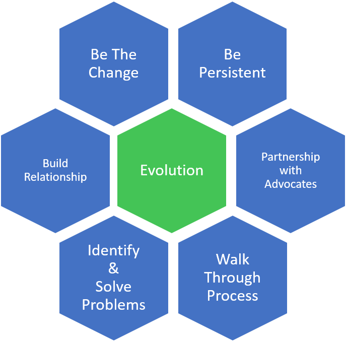

## Q#1: how do you work with technologists?

situation: [AECL] difficult situation / deal with conflict

Action:  
1) developed a macro to process data and calculate uncertainty  
2) monitored instrument intensity  
3) self learnt knowledge  

Results:   
1) Built trust in relationship,   
The senior technologist handed over the data review to me.  
2) Built credibility,  
3) Saved them from tedious works

## Q#2: how did you implement change/improvement?

1) Be the change.  I implemented many changes for good.  
2) Build relationship.  
3) Meet co-workers' needs.  
4) Be persistent.  
5) Partnership with advocates  
6) Walk through the process.

