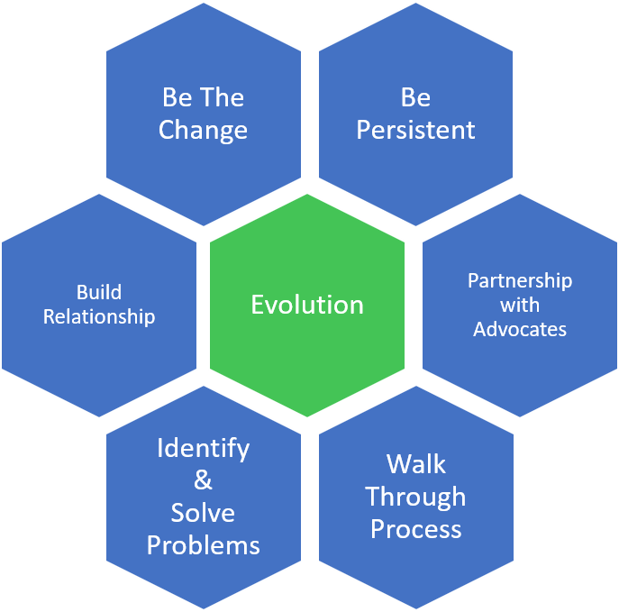

Q#1: how do you work with technologists?

situation: [AECL] difficult situation

Action: 1) developed a macro to process data and calculate uncertainty  
2) monitored instrument intensity  
3) self learnt knowledge

Result: Built trust in relationship  
The senior technologist handed over the data review to me. 

Q#2: how did you implement change/improvement?

